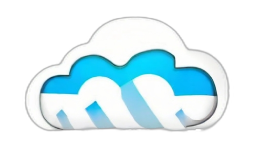
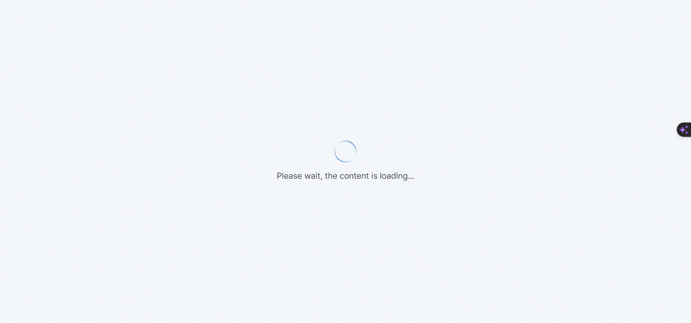
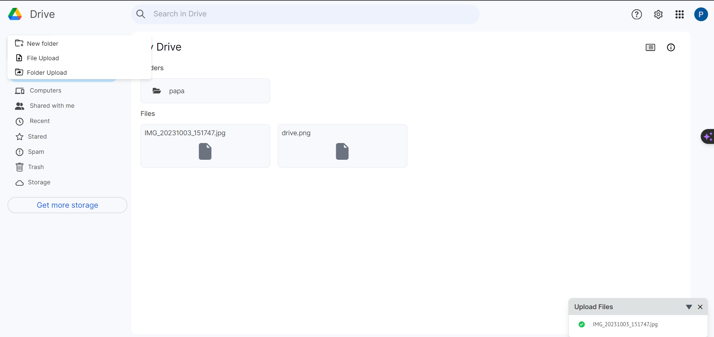

# [Cloud Drive Clone](https://cloud-drive-seven.vercel.app/)



A cloud storage platform clone, built with Next.js, TypeScript, and Tailwind CSS, deployed on Vercel. This project aims to replicate the user interface and core functionalities of Google Drive, offering a similar experience for users to manage their files and folders in the cloud.

## Features

-  User authentication: Sign in and out securely.
-  File and folder management: Create, upload, view, and organize files and folders.
-  Real-time updates: Changes to files and folders are instantly reflected.
-  Share files: Share files and folders with other users.
-  Responsive design: Works seamlessly on various devices.

## Demo



Check out the live demo of the Cloud Drive Clone [here](https://cloud-drive-seven.vercel.app/).

## Technologies Used

-  Next.js: A popular React framework for building web applications.
-  TypeScript: A statically-typed superset of JavaScript.
-  Tailwind CSS: A utility-first CSS framework for designing modern websites.
-  Vercel: A cloud platform for deploying your applications.

## Installation

1. Clone the repository:

   ```bash
   https://github.com/lieTester/cloudDrive.git
   ```

2. Navigate to the project folder:

   ```
   cd cloud-drive
   ```

3. Install dependencies:

   ```
   npm install
   ```

4. Start the development server:

   ```
   npm run dev
   ```

5. Open your browser and visit [http://localhost:3000](http://localhost:3000/) to view the application.

## Usage

1. Sign up for an account or log in if you already have one.
   
2. Start managing your files and folders in the cloud, just like you would with Google Drive!
   

## Contributing

Contributions are welcome! Feel free to open issues or submit pull requests to help improve this project.

## License

This project is licensed under the MIT License. See the [LICENSE](./License) file for details.

## Acknowledgments

-  Thanks to the creators of Google Drive for the inspiration.
-  Icons made by [ReactIcons](https://react-icons.github.io/).
